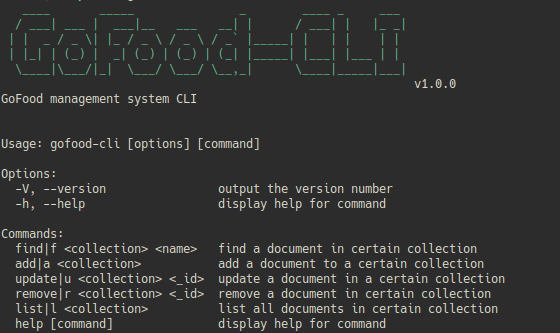

# gofood-cli
a simple GoFood management system built with NodeJS CLI and MongoDB



## usage

1. clone or download this project 
2. initialize node project inside the directory using ```npm init```
3. install dependencies ```npm install``` 
 4. run with ```node commands```
 
 ## references
 
 - [commander](https://github.com/tj/commander.js/)
 - [inquirer](https://github.com/SBoudrias/Inquirer.js/)
 - [mongoose](https://mongoosejs.com/docs/index.html)
 - [easy-table](https://github.com/eldargab/easy-table)
 - [inquirer-datepicker-prompt](https://github.com/DerekTBrown/inquirer-datepicker-prompt)
 - [cli-logo](https://github.com/labs-js/cli-logo)
 - [[video] Build A Command Line Interface With Node.js & MongoDB](https://youtu.be/v2GKt39-LPA)
